# A Non-Overlapping Schwarz Hybrid Finite Element–Neural Operator Framework for Solid Mechanics on Irregular Domains

[](https://doi.org/10.1016/j.cma.2026.119365)
[](https://arxiv.org/abs/2606.08796)
[](https://www.python.org/downloads/)
[](https://github.com/google/jax)
[](https://fenicsproject.org/)

**Wei Wang** ([wwang198@jh.edu](mailto:wwang198@jh.edu)) ·
**Abhinav Gupta** ·
**Haihui Ruan** ·
**Somdatta Goswami** ([somdatta@jhu.edu](mailto:somdatta@jhu.edu))

*Johns Hopkins Whiting School of Engineering, Baltimore, MD 21218, United States*

---

Official implementation of **"A Non-Overlapping Schwarz Hybrid Finite Element–Neural Operator
Framework for Solid Mechanics on Irregular Domains"**, published in *Computer Methods in Applied
Mechanics and Engineering* **463** (2027) 119365.

This is the successor to our overlapping FE–NO framework
([Wang et al., CMAME 446 (2025) 118319](https://doi.org/10.1016/j.cma.2025.118319) ·
[code](https://github.com/Centrum-IntelliPhysics/Time-Marching-Neural-Operator-FE-Coupling)).

<div align="center">
  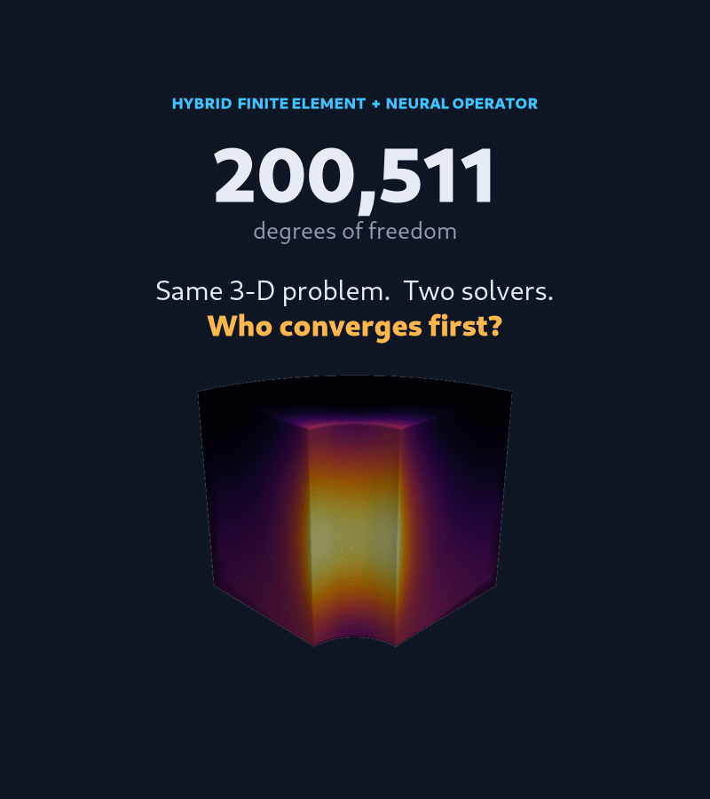
</div>

---

## What is new

The earlier FE–NO framework coupled a physics-informed DeepONet to an FE solver through an
**overlapping** domain decomposition with **Dirichlet–Dirichlet** interface exchange. Two limitations
followed from that choice: the overlap layer required redundant interface computations that inflated
the inner Schwarz iteration count, and a convolutional feature extractor confined the NO subdomain to
structured grids. This work removes both.

| | Overlapping (Wang et al., 2025) | **Non-overlapping (this work)** |
|---|---|---|
| Interface | overlap layer, $\Gamma_{\rm NO} \neq \Gamma_{\rm FE}$ | shared interface, $\Gamma_{\rm NO} = \Gamma_{\rm FE}$ |
| Exchange | Dirichlet–Dirichlet | **Neumann–Dirichlet** (traction NO → FE) |
| NO subdomain | structured grid (CNN branch) | **arbitrary point cloud** (PointNet branch) |
| Geometry | convex, grid-aligned | **non-convex and irregular** |
| Strain / stress | separate networks | **derived analytically** from the displacement operator |
| Inner Schwarz iterations (elastodynamic) | 9 | **3** |

<table>
<tr>
<td width="50%">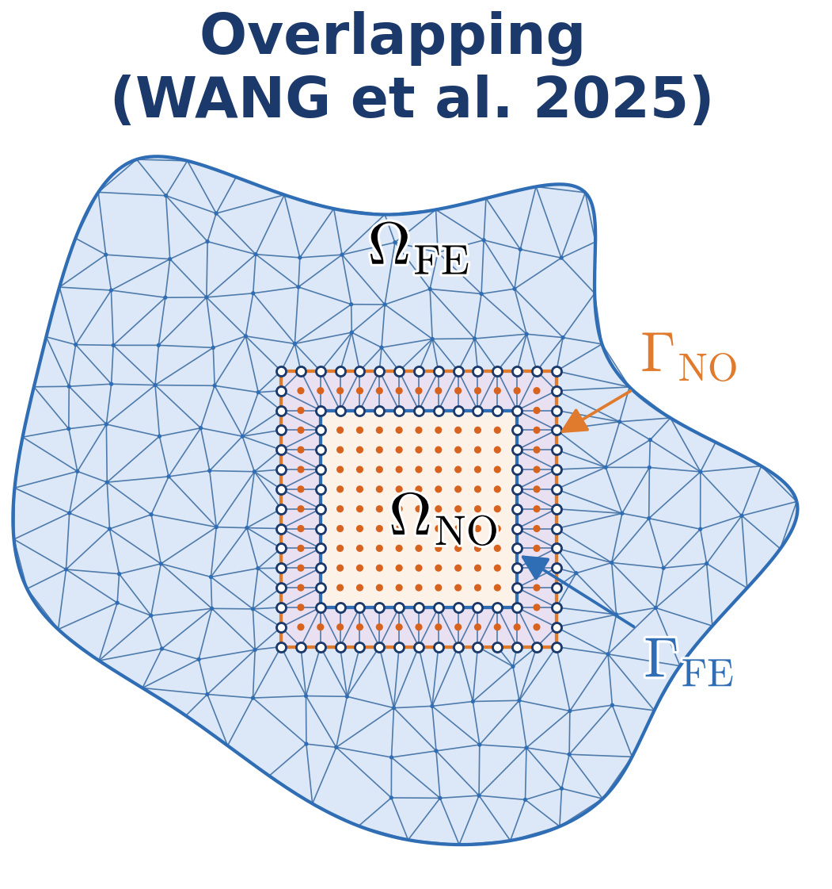</td>
<td width="50%">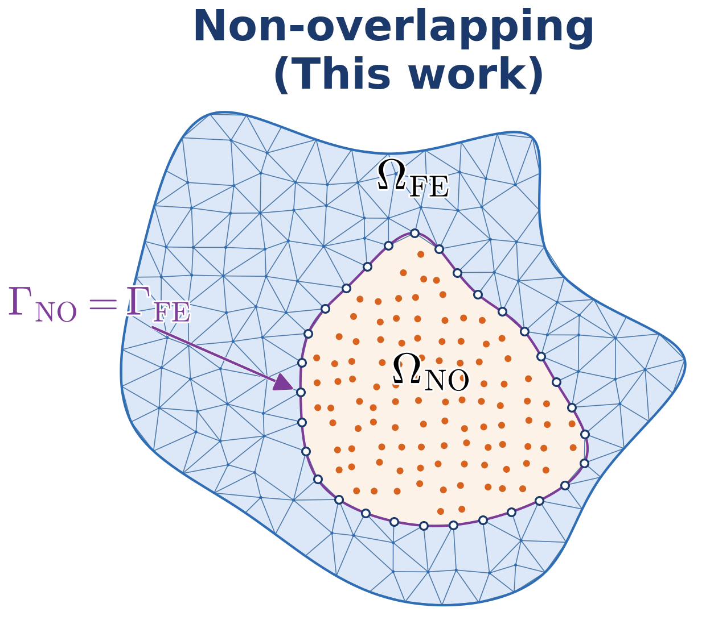</td>
</tr>
</table>

---

## Abstract

Finite element (FE) methods are the benchmark for solid mechanics simulations, yet their
computational cost becomes prohibitive for problems with localised nonlinearities, fine-scale
features, or long-time dynamic evolution. In our earlier FE–neural operator (FE–NO) hybrid framework,
physics-informed deep operator networks were coupled with FE solvers through overlapping domain
decomposition with Dirichlet–Dirichlet interface exchange, accelerating intensive subdomains while
preserving FE fidelity elsewhere. Two limitations remained: the overlapping formulation required
redundant interface computations that increased inner Schwarz iteration counts, and the convolutional
feature extractor restricted the NO subdomain to structured grids, precluding irregular geometries.

A non-overlapping Schwarz alternating method with Neumann–Dirichlet interface exchange replaces it,
transmitting traction from the NO to FE rather than displacement. This eliminates the overlap layer
and reduces inner Schwarz iterations while maintaining bounded error accumulation across all tested
time horizons. For arbitrarily shaped subdomains, a Point-DeepONet operates on unstructured FE point
clouds without interpolation, extending it to non-convex and irregular geometries. Strain and stress
operators are derived analytically from the displacement operators via kinematic equations, rather
than as independent networks, reducing trainable parameter sets while enforcing mechanical
consistency by construction. The framework is validated on three benchmarks: static linear
elasticity, quasi-static hyperelasticity, and elastodynamics with regular and irregular geometries.
These results establish a non-overlapping FE–NO coupling paradigm that is geometry-flexible,
parameter-efficient, and convergence-stable, providing a pathway for hybrid physics-based and
operator-learning solvers in large-scale dynamic solid mechanics.

---

## Key contributions

- **Non-overlapping Schwarz coupling with Neumann–Dirichlet exchange.** The NO subdomain returns
  *traction* to the FE solver instead of displacement, so the two subdomains meet at a single shared
  interface. The overlap layer and its redundant interface work disappear, and the inner Schwarz
  iteration count drops.
- **Point-DeepONet for irregular geometries.** A PointNet branch consumes the unstructured FE point
  cloud directly — no interpolation onto a structured grid — which lifts the framework to non-convex
  and irregular subdomains such as the L-shape and the 3-D tube.
- **Analytically derived strain and stress operators.** Kinematic relations are applied to the
  displacement operator rather than training separate networks, which shrinks the trainable parameter
  set and enforces mechanical consistency by construction.
- **Bounded error over long horizons.** Autoregressive error stays bounded and non-monotonic across
  every tested time horizon, rather than accumulating.

---

## Method

### 1. Non-overlapping interface coupling

$\Omega$ is partitioned into an FE subdomain $\Omega_{\rm FE}$ and a neural-operator subdomain
$\Omega_{\rm NO}$ that share one interface, $\Gamma_{\rm NO} = \Gamma_{\rm FE}$. The Schwarz
alternating iteration passes **Dirichlet data (displacement)** from FE to NO, and **Neumann data
(traction)** back from NO to FE.

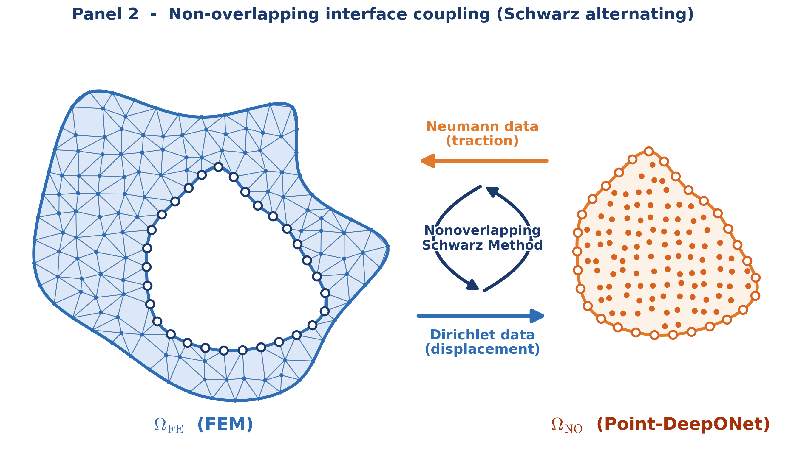

*([vector PDF](readme_figures/method_interface_coupling.pdf))*

### 2. Point-DeepONet

The displacement operator takes three inputs: a **PointNet branch** over the point cloud carrying the
previous-step kinematics $(x_0, y_0, u^{n-1}, \dot{u}^{n-1})$, a **second branch** encoding the
interface boundary data $u^n|_{\partial\Omega}$, and a **trunk** over the query coordinates. Strain
components $\mathcal{G}^{\varepsilon_{xx}}, \mathcal{G}^{\varepsilon_{xy}},
\mathcal{G}^{\varepsilon_{yy}}$ follow from $\mathcal{G}^{u_x}, \mathcal{G}^{u_y}$ by
differentiation — they are not separate networks.

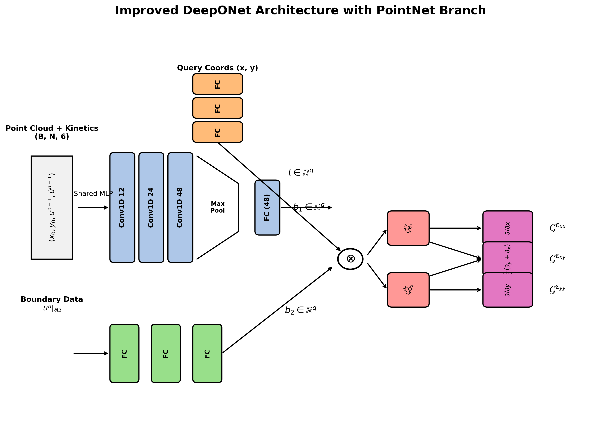

### 3. Time marching for dynamics

Temporal coupling uses Newmark integration: given $(u_{n-1}, \dot{u}_{n-1}, \ddot{u}_{n-1})$, the
Point-DeepONet predicts $u_n$ on the point cloud while the FE solver advances $\Omega_{\rm FE}$ with
interface BCs, and the velocity and acceleration are then updated. Static and quasi-static problems
need the spatial coupling only.

<div align="center">
  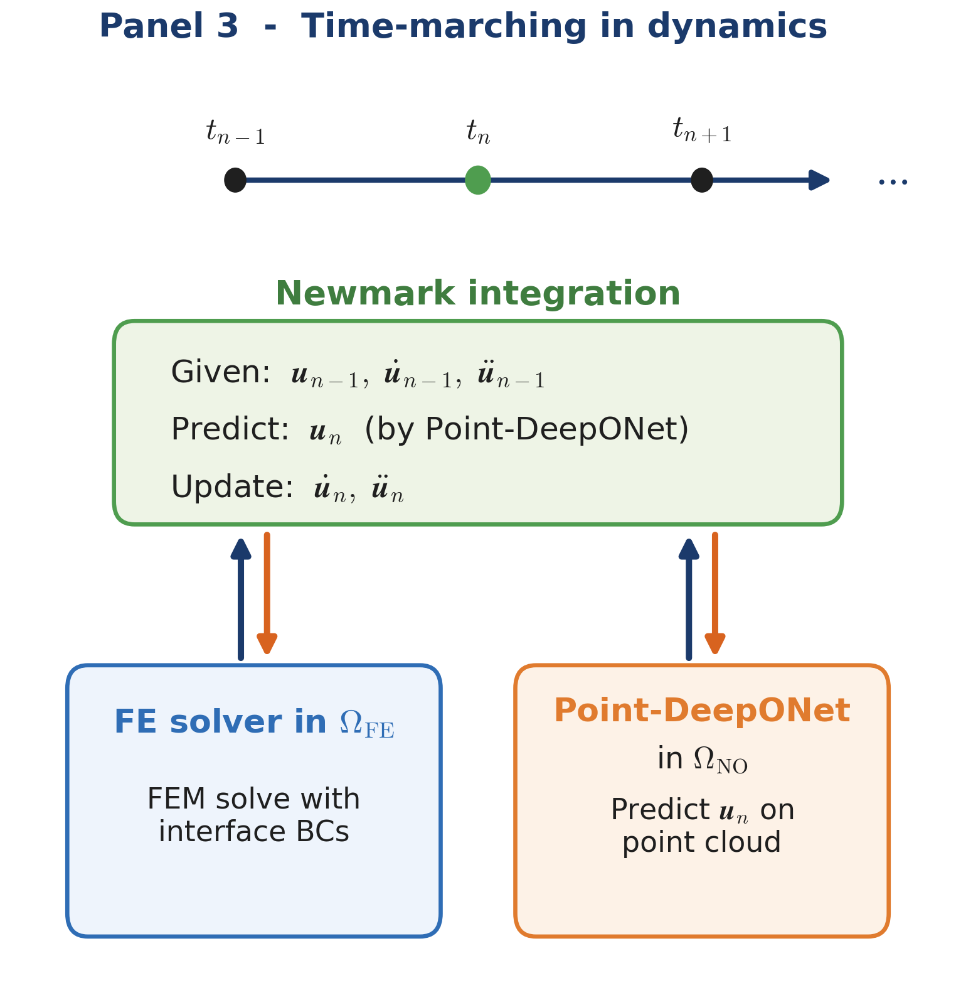
</div>

*([vector PDF](readme_figures/method_time_marching.pdf))*

---

## Benchmarks

| Case | Directory | Problem | NO subdomain |
|---|---|---|---|
| 1 | [`Non_overlapping_static/`](Non_overlapping_static) | Linear elasticity, static | disk |
| 2 | [`Non_overlapping_hyper_quasi_static/`](Non_overlapping_hyper_quasi_static) | Hyperelasticity, quasi-static | disk |
| 3 | [`Non_overlapping_dynamic_irregular/`](Non_overlapping_dynamic_irregular) | Elastodynamics | disk |
| 4 | [`Non_overlapping_dynamic_irregular/`](Non_overlapping_dynamic_irregular) | Elastodynamics, **non-convex** | L-shape |
| 5 | [`Non_overlapping_cylinder_3D/`](Non_overlapping_cylinder_3D) | Linear elasticity, static, **3-D** | tube sector |

Cases 1–4, with the training loss histories of the corresponding Point-DeepONets
($\mathcal{L}_{bcs,u}$, $\mathcal{L}_{res}$, $\mathcal{L}_{bcs,\varepsilon}$, $\mathcal{L}_{test}$):

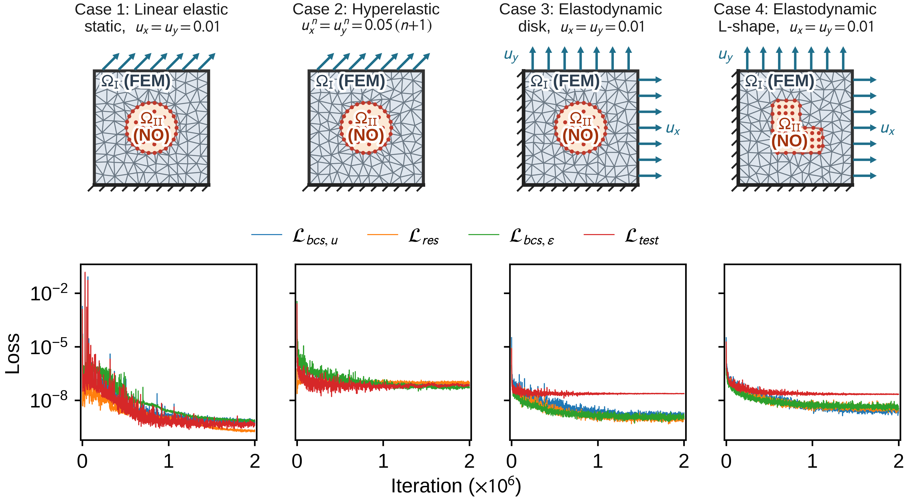

*([vector PDF](readme_figures/benchmarks_and_training_loss.pdf))*

Case 5 extends the framework to three dimensions — a tube sector loaded on its inner surface, with
roller symmetry conditions:

<div align="center">
  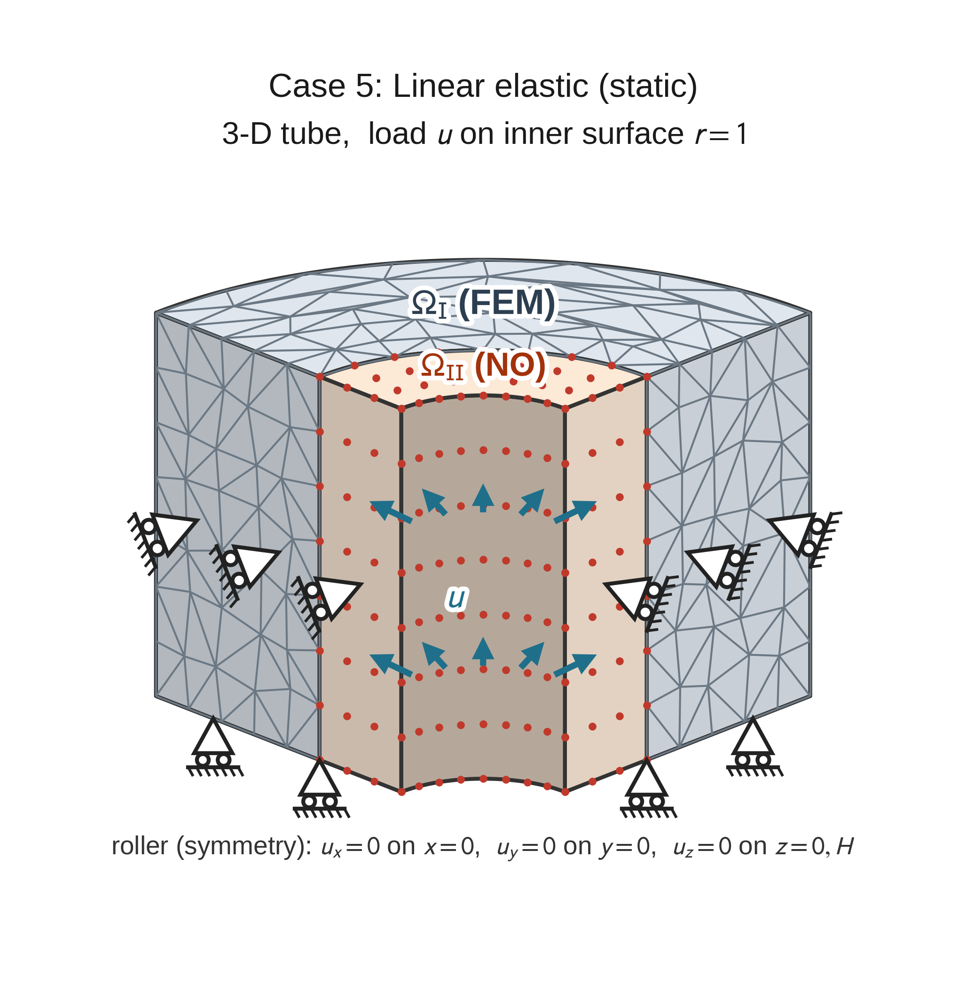
</div>

---

## Results

### Fewer inner Schwarz iterations

The non-overlapping FE–NO coupling reaches a given interface tolerance in fewer inner iterations than
both the FE–FE reference and the earlier overlapping formulation.

| Static linear elasticity (Case 1) | Elastodynamics (Case 3) |
|---|---|
| 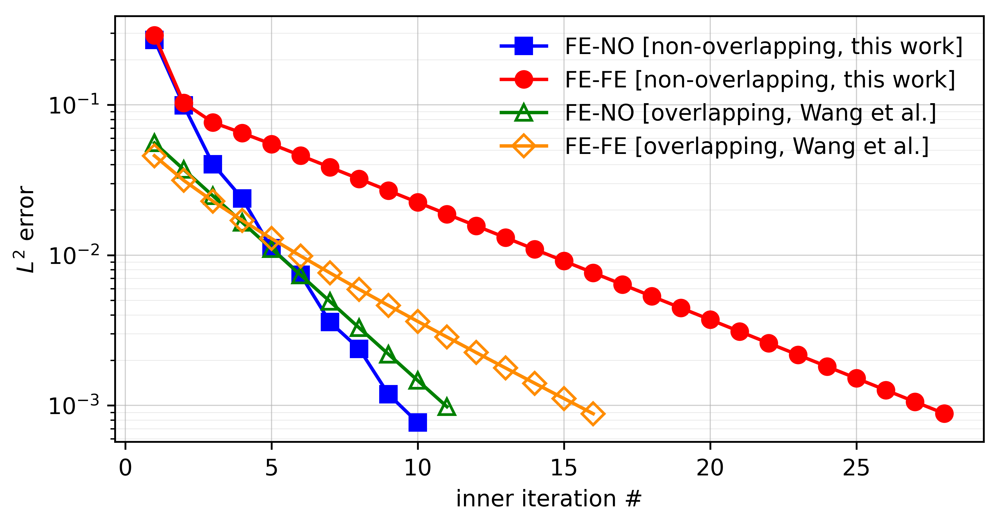 | 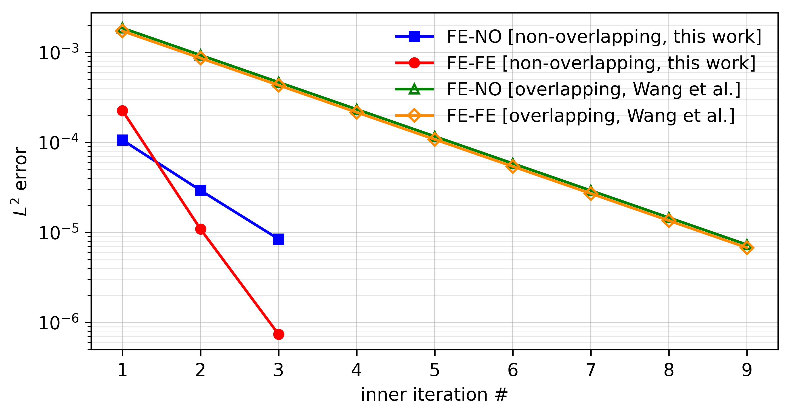 |

In the static case, FE–NO converges in **10** inner iterations against **28** for non-overlapping
FE–FE and **11** for the earlier overlapping FE–NO. In the elastodynamic case, the non-overlapping
formulation needs **3** inner iterations where the overlapping one needs **9**:

<div align="center">
  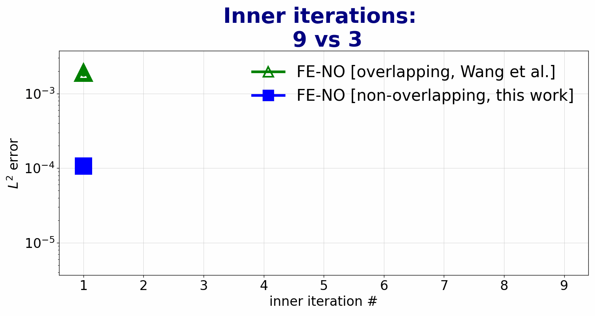
</div>

### Bounded error over long time horizons

Autoregressive error does not grow monotonically — it fluctuates within a bounded envelope, for both
the convex disk and the non-convex L-shape.

| Case 3 — disk | Case 4 — L-shape |
|---|---|
| 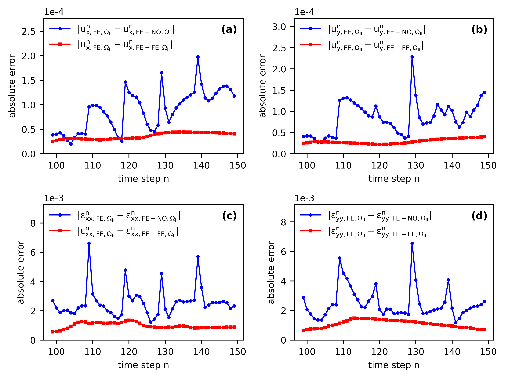 | 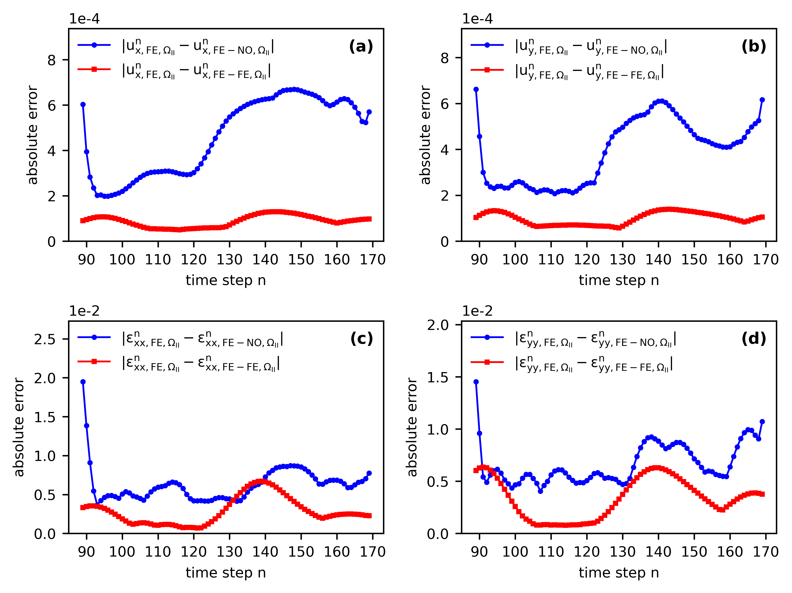 |

### Representative fields

Each figure compares the FE–FE reference (top) against FE–NO coupling (bottom), over the global
domain $\Omega_{\rm I}$ and the neural-operator subdomain $\Omega_{\rm II}$, with the absolute error
at the final iteration or time step.

**Case 1 — static displacement $u_x$.** FE–NO reaches the converged field in 10 iterations, FE–FE in 28:

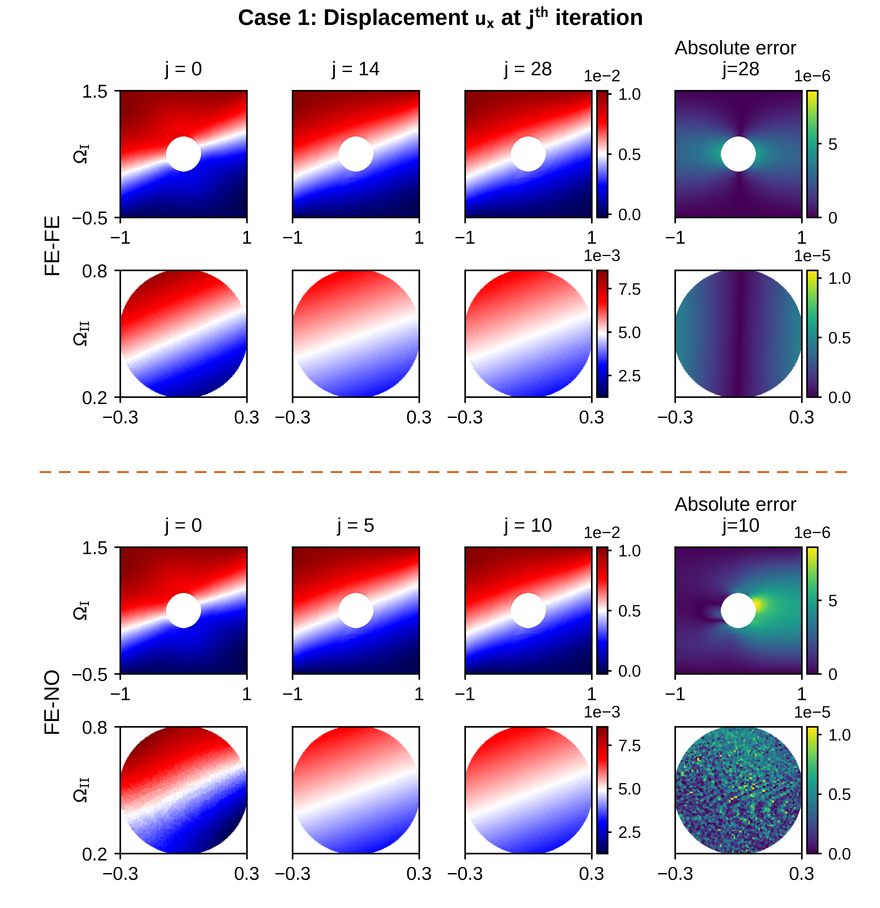

**Case 2 — hyperelastic stress:**

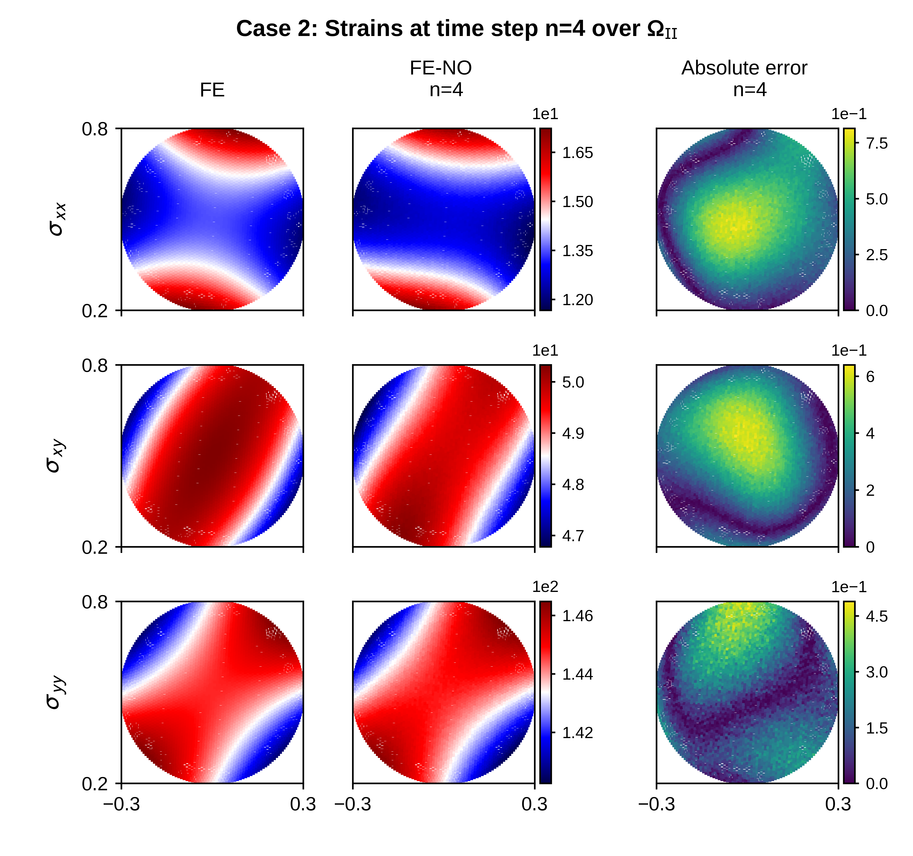

**Case 4 — elastodynamic wave propagation through a non-convex L-shaped NO subdomain:**

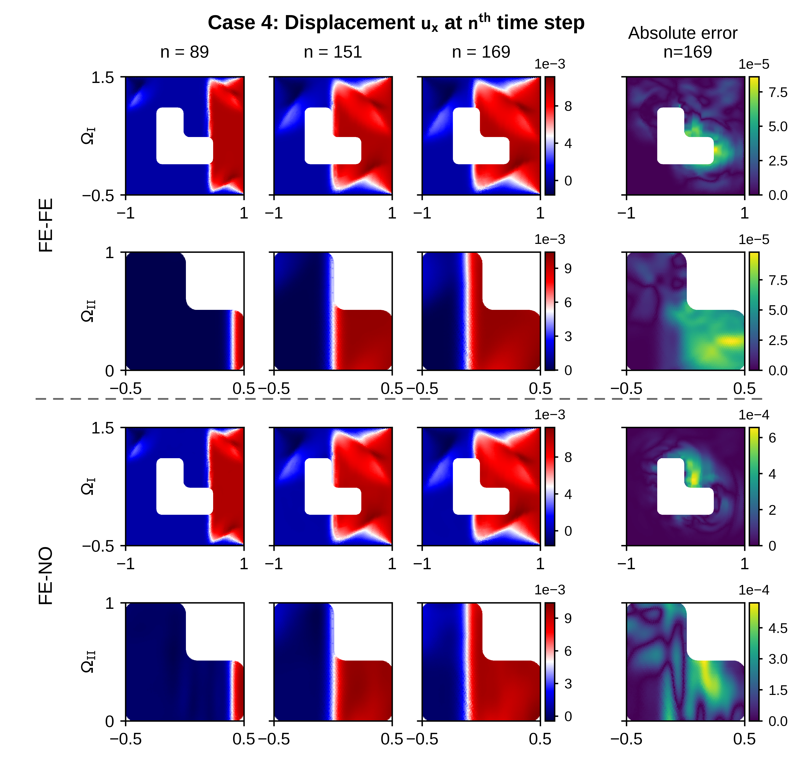

---

## Repository structure

```
Time-Marching-Non-overlapping-Neural-operator-FE-Coupling/
├── README.md
├── readme_figures/                     # figures used by this README
│
├── Non_overlapping_static/             # Case 1 — linear elasticity, static
│   ├── FE_full_static.py                   # 1. FE reference / data generation
│   ├── FE_full_static_RBF.py               #    RBF-sampled boundary variant
│   ├── prepare_DeepONet_static_uv_strain_bcs_test5.py   # 2. train the Point-DeepONet
│   ├── FE_DeepONet_static_coupling.py      # 3. FE-NO coupled simulation
│   ├── MSE_error_static.py                 # 4. error evaluation
│   └── utils.py
│
├── Non_overlapping_hyper_quasi_static/ # Case 2 — hyperelasticity, quasi-static
│   ├── Gmsh_hyper_non_overlapping_triangle.py           # 0. mesh generation
│   ├── FE_full_sqaure_hyper_all_dataset.py              # 1. FE reference / data generation
│   ├── FE_full_sqaure_hyper_one_traction_Ground_truth.py
│   ├── prepare_DeepONet_hyper_elastic.py                # 2. train
│   ├── FE_DeepONet_hyper_quasi_static_coupling_non_overlapping_real_sigma_arearatio.py  # 3. couple
│   ├── MSE_error.py                                     # 4. error evaluation
│   └── Hyper_utils.py
│
├── Non_overlapping_dynamic_irregular/  # Cases 3 & 4 — elastodynamics, disk and L-shape
│   ├── full_square_with_L_shape_all_dataset_CG2.py      # 1. FE reference / data generation
│   ├── dataload_from_full_square_dataset_89_169_CG2_irregular.py   #    dataset assembly
│   ├── prepare_DeepONet_Elasto_dynamic_ts_89_169_non_overlapping_irregular.py  # 2. train
│   ├── FE_NO_coupling_ufl_real_vtk.py                   # 3. FE-NO coupled simulation
│   └── dynamic_utils.py
│
└── Non_overlapping_cylinder_3D/        # Case 5 — 3-D tube, static
    ├── Mesh_3D_cylinder/                                # 0. mesh
    ├── FE_FE_static_coupling_r_2_mirror_save_iters.py   # 1. FE-FE reference
    ├── prepare_DeepONet_3D_tube_r_2_final_regularization.py  # 2. train
    ├── FE_NO_static_coupling_r_2_sigma_save_iters.py    # 3. FE-NO coupled simulation
    ├── gp_boundary.py                                   #    GP-sampled boundary conditions
    └── utils.py
```

Within every case the execution order is the same:

| Step | File pattern | What it does |
|---|---|---|
| 0 | `Gmsh_*` / `Mesh_*` | build the mesh (cases 2 and 5) |
| 1 | `FE_full_*` / `FE_FE_*` | run the standalone FE simulation — reference solution and training data |
| 2 | `prepare_DeepONet_*` | train the Point-DeepONet for that subdomain |
| 3 | `FE_DeepONet_*` / `FE_NO_*` | run the FE–NO coupled simulation |
| 4 | `MSE_error*` | compare against the FE reference |

---

## Getting started

Create the conda environment and install [FEniCSx](https://fenicsproject.org/download/):

```bash
conda create -n fenicsx-env python=3.12
conda activate fenicsx-env
conda install -c conda-forge fenics-dolfinx=0.8.0 mpich pyvista gmsh
```

Install [JAX](https://docs.jax.dev/en/latest/installation.html) — the CUDA build for GPU training:

```bash
pip install --upgrade pip
# NVIDIA CUDA 12; wheels are Linux-only
pip install --upgrade "jax[cuda12]==0.4.34"
pip install flax optax
```

Versions used for the results in the paper:

```
Python                3.12.13
jax                   0.4.34
jaxlib                0.4.34
jax-cuda12-pjrt       0.4.34
jax-cuda12-plugin     0.4.34
fenics-basix          0.8.0
fenics-dolfinx        0.8.0
fenics-ffcx           0.8.0
fenics-ufl            2024.1.0
numpy                 2.1.3
gmsh                  4.15.2
```

The FE reference runs and the coupled simulations use FEniCSx on CPU; Point-DeepONet training uses
JAX on GPU.

---

## Citation

If you find this repository useful, please cite:

```bibtex
@article{WANG2027119365,
  title   = {A non-overlapping Schwarz hybrid finite element--neural operator framework
             for solid mechanics on irregular domains},
  journal = {Computer Methods in Applied Mechanics and Engineering},
  volume  = {463},
  pages   = {119365},
  year    = {2027},
  issn    = {0045-7825},
  doi     = {10.1016/j.cma.2026.119365},
  author  = {Wei Wang and Abhinav Gupta and Haihui Ruan and Somdatta Goswami}
}
```

and, for the overlapping framework this work builds on:

```bibtex
@article{WANG2025118319,
  title   = {Time-marching neural operator--FE coupling: AI-accelerated physics modeling},
  journal = {Computer Methods in Applied Mechanics and Engineering},
  volume  = {446},
  pages   = {118319},
  year    = {2025},
  issn    = {0045-7825},
  doi     = {10.1016/j.cma.2025.118319},
  author  = {Wei Wang and Maryam Hakimzadeh and Haihui Ruan and Somdatta Goswami}
}
```

---

## Contact

For more information or questions, please contact:

- [Wei Wang](mailto:wwang198@jh.edu)
- [Somdatta Goswami](mailto:somdatta@jhu.edu)

The FE–NO coupling framework is currently being explored for large-scale realistic problems in
engineering and the life sciences. We warmly welcome suggestions and feedback, and we are open to
collaborating with researchers from diverse fields!
