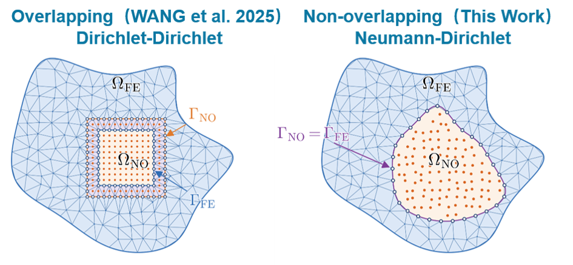
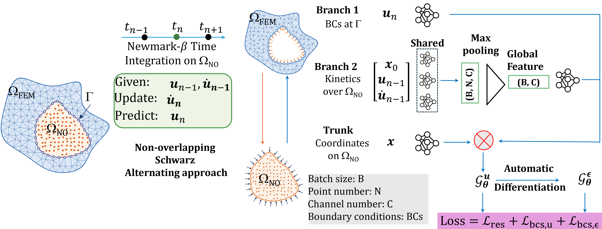
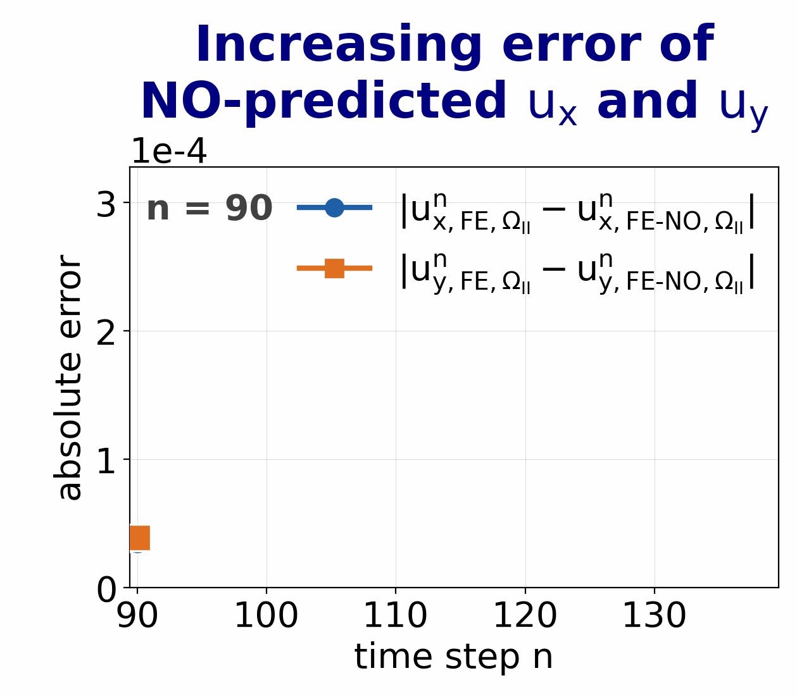
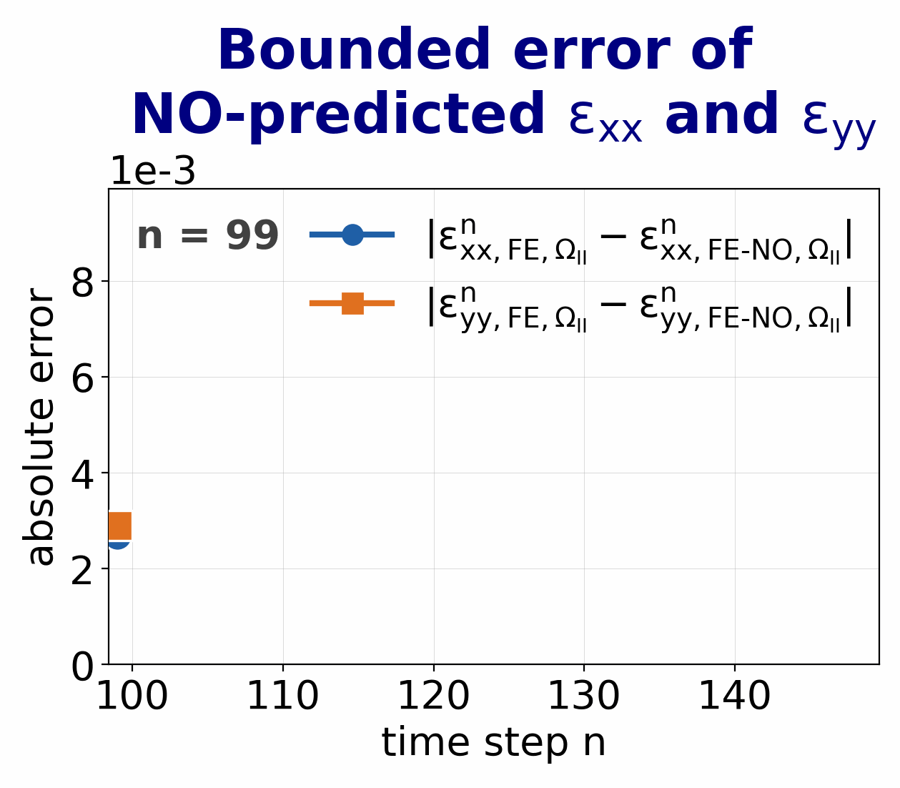
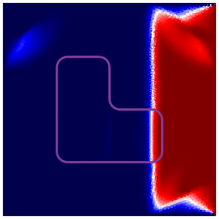
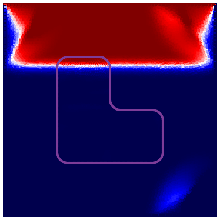

# A Non-Overlapping Schwarz Hybrid Finite Element–Neural Operator Framework for Solid Mechanics on Irregular Domains

[](https://doi.org/10.1016/j.cma.2026.119365)
[](https://arxiv.org/abs/2606.08796)
[](https://www.python.org/downloads/)
[](https://github.com/google/jax)
[](https://fenicsproject.org/)

**Wei Wang** ([wwang198@jh.edu](mailto:wwang198@jh.edu)) ·
**Abhinav Gupta** ·
**Haihui Ruan** ·
**Somdatta Goswami** ([somdatta@jhu.edu](mailto:somdatta@jhu.edu))

*Johns Hopkins Whiting School of Engineering, Baltimore, MD 21218, United States*

---

Official implementation of **"A Non-Overlapping Schwarz Hybrid Finite Element–Neural Operator
Framework for Solid Mechanics on Irregular Domains"**, published in *Computer Methods in Applied
Mechanics and Engineering* **463** (2027) 119365.

This is the successor to our overlapping FE–NO framework
([Wang et al., CMAME 446 (2025) 118319](https://doi.org/10.1016/j.cma.2025.118319) ·
[code](https://github.com/Centrum-IntelliPhysics/Time-Marching-Neural-Operator-FE-Coupling)).

<div align="center">
  
</div>

---

## What is new

The earlier FE–NO framework used an **overlapping** domain decomposition with **Dirichlet–Dirichlet**
interface exchange. The overlap layer required redundant interface computations that inflated the
inner Schwarz iteration count, and a convolutional feature extractor confined the NO subdomain to
structured grids. This work removes both limitations.



| | Overlapping (Wang et al., 2025) | **Non-overlapping (this work)** |
|---|---|---|
| Interface | overlap layer, Γ<sub>NO</sub> ≠ Γ<sub>FE</sub> | shared interface, Γ<sub>NO</sub> = Γ<sub>FE</sub> |
| Exchange | Dirichlet–Dirichlet | **Neumann–Dirichlet** (traction NO → FE) |
| NO subdomain | structured grid (CNN branch) | **arbitrary point cloud** (PointNet branch) |
| Geometry | convex, grid-aligned | **non-convex and irregular** |
| Strain / stress | separate networks | **derived analytically** from the displacement operator |
| Inner Schwarz iterations (elastodynamic) | 9 | **3** |

---

## Key contributions

- **Non-overlapping Schwarz coupling** with Neumann–Dirichlet exchange — the NO subdomain returns
  traction instead of displacement, eliminating the overlap layer and its redundant interface work.
- **Point-DeepONet** consumes the unstructured FE point cloud directly, lifting the framework to
  non-convex and irregular subdomains without interpolation.
- **Analytically derived strain and stress operators** from the displacement operator, which shrinks
  the trainable parameter set and enforces mechanical consistency by construction.
- **Bounded error over long horizons** — autoregressive error stays bounded and non-monotonic across
  every tested time horizon.

---

## Method



### 1. Non-overlapping interface coupling

Ω is partitioned into an FE subdomain Ω<sub>FE</sub> and a neural-operator subdomain
Ω<sub>NO</sub> that share one interface, Γ<sub>NO</sub> = Γ<sub>FE</sub>. The Schwarz
alternating iteration passes **Dirichlet data (displacement)** from FE to NO, and **Neumann data
(traction)** back from NO to FE.

### 2. Point-DeepONet

**Branch 1** encodes the interface boundary conditions u<sub>n</sub>|<sub>Γ</sub>. **Branch 2** is a PointNet over
the point cloud carrying the previous-step kinematics (x₀, u<sub>n−1</sub>, u̇<sub>n−1</sub>) — shared MLPs
followed by max pooling reduce (B, N, C) to a global feature (B, C). The **trunk** encodes query
coordinates on Ω<sub>NO</sub>. Their product gives the displacement operator
<b>G</b><sup>u</sup><sub>θ</sub>, and automatic differentiation yields the strain operator
<b>G</b><sup>ε</sup><sub>θ</sub> — not a separate network. Training minimises
<b>L</b> = <b>L</b><sub>res</sub> + <b>L</b><sub>bcs,u</sub> + <b>L</b><sub>bcs,ε</sub>.

### 3. Time marching for dynamics

Temporal coupling uses Newmark-β integration on Ω<sub>NO</sub>: given
(u<sub>n−1</sub>, u̇<sub>n−1</sub>), the Point-DeepONet predicts u<sub>n</sub> while the FE solver advances
Ω<sub>FE</sub> with interface BCs, then u̇<sub>n</sub> is updated. Static and quasi-static problems
need the spatial coupling only.

---

## Benchmarks

| Case | Directory | Problem | NO subdomain |
|---|---|---|---|
| 1 | [`Non_overlapping_static/`](Non_overlapping_static) | Linear elasticity, static | disk |
| 2 | [`Non_overlapping_hyper_quasi_static/`](Non_overlapping_hyper_quasi_static) | Hyperelasticity, quasi-static | disk |
| 3 | [`Non_overlapping_dynamic_irregular/`](Non_overlapping_dynamic_irregular) | Elastodynamics | disk |
| 4 | [`Non_overlapping_dynamic_irregular/`](Non_overlapping_dynamic_irregular) | Elastodynamics, **non-convex** | L-shape |
| 5 | [`Non_overlapping_cylinder_3D/`](Non_overlapping_cylinder_3D) | Linear elasticity, static, **3-D** | tube sector |

---

## Results

### Fewer inner Schwarz iterations

The non-overlapping FE–NO coupling reaches a given interface tolerance in fewer inner iterations than
both the FE–FE reference and the earlier overlapping formulation.

| Static linear elasticity (Case 1) | Elastodynamics (Case 3) |
|---|---|
|  |  |

In the static case, FE–NO converges in **10** inner iterations against **28** for non-overlapping
FE–FE and **11** for the earlier overlapping FE–NO. In the elastodynamic case, the non-overlapping
formulation needs **3** inner iterations where the overlapping one needs **9**:

<div align="center">
  
</div>

### Bounded error over long time horizons

Under the non-overlapping coupling the autoregressive error does not grow monotonically — it
fluctuates within a bounded envelope over the full horizon. Under the earlier overlapping
formulation it trends upward as the horizon lengthens.

| Overlapping (Wang et al., 2025) | **Non-overlapping (this work)** |
|---|---|
|  |  |

> **Note.** The two panels are not a like-for-like magnitude comparison: the overlapping case plots
> *displacement* error (u<sub>x</sub>, u<sub>y</sub>, order 10<sup>−4</sup>) over time steps 90–130,
> while the non-overlapping case plots *strain* error (ε<sub>xx</sub>, ε<sub>yy</sub>, order
> 10<sup>−3</sup>) over steps 100–150. What they contrast is the **trend** — increasing versus
> bounded — not the absolute error level.

### Elastodynamics on a non-convex subdomain

Case 4 — wave propagation across the shared interface, with the L-shaped NO subdomain outlined. The
FE and neural-operator subdomains are shown as one continuous field.

| u<sub>x</sub> | u<sub>y</sub> |
|---|---|
|  |  |

---

## Repository structure

```
Time-Marching-Non-overlapping-Neural-operator-FE-Coupling/
├── README.md
├── readme_figures/                     # figures used by this README
│
├── Non_overlapping_static/             # Case 1 — linear elasticity, static
│   ├── FE_full_static.py                   # 1. FE reference / data generation
│   ├── FE_full_static_RBF.py               #    RBF-sampled boundary variant
│   ├── prepare_DeepONet_static_uv_strain_bcs_test5.py   # 2. train the Point-DeepONet
│   ├── FE_DeepONet_static_coupling.py      # 3. FE-NO coupled simulation
│   ├── MSE_error_static.py                 # 4. error evaluation
│   └── utils.py
│
├── Non_overlapping_hyper_quasi_static/ # Case 2 — hyperelasticity, quasi-static
│   ├── Gmsh_hyper_non_overlapping_triangle.py           # 0. mesh generation
│   ├── FE_full_sqaure_hyper_all_dataset.py              # 1. FE reference / data generation
│   ├── FE_full_sqaure_hyper_one_traction_Ground_truth.py
│   ├── prepare_DeepONet_hyper_elastic.py                # 2. train
│   ├── FE_DeepONet_hyper_quasi_static_coupling_non_overlapping_real_sigma_arearatio.py  # 3. couple
│   ├── MSE_error.py                                     # 4. error evaluation
│   └── Hyper_utils.py
│
├── Non_overlapping_dynamic_irregular/  # Cases 3 & 4 — elastodynamics, disk and L-shape
│   ├── full_square_with_L_shape_all_dataset_CG2.py      # 1. FE reference / data generation
│   ├── dataload_from_full_square_dataset_89_169_CG2_irregular.py   #    dataset assembly
│   ├── prepare_DeepONet_Elasto_dynamic_ts_89_169_non_overlapping_irregular.py  # 2. train
│   ├── FE_NO_coupling_ufl_real_vtk.py                   # 3. FE-NO coupled simulation
│   └── dynamic_utils.py
│
└── Non_overlapping_cylinder_3D/        # Case 5 — 3-D tube, static
    ├── Mesh_3D_cylinder/                                # 0. mesh
    ├── FE_FE_static_coupling_r_2_mirror_save_iters.py   # 1. FE-FE reference
    ├── prepare_DeepONet_3D_tube_r_2_final_regularization.py  # 2. train
    ├── FE_NO_static_coupling_r_2_sigma_save_iters.py    # 3. FE-NO coupled simulation
    ├── gp_boundary.py                                   #    GP-sampled boundary conditions
    └── utils.py
```

Within every case the execution order is the same:

| Step | File pattern | What it does |
|---|---|---|
| 0 | `Gmsh_*` / `Mesh_*` | build the mesh (cases 2 and 5) |
| 1 | `FE_full_*` / `FE_FE_*` | run the standalone FE simulation — reference solution and training data |
| 2 | `prepare_DeepONet_*` | train the Point-DeepONet for that subdomain |
| 3 | `FE_DeepONet_*` / `FE_NO_*` | run the FE–NO coupled simulation |
| 4 | `MSE_error*` | compare against the FE reference |

---

## Getting started

Create the conda environment and install [FEniCSx](https://fenicsproject.org/download/):

```bash
conda create -n fenicsx-env python=3.12
conda activate fenicsx-env
conda install -c conda-forge fenics-dolfinx=0.8.0 mpich pyvista gmsh
```

Install [JAX](https://docs.jax.dev/en/latest/installation.html) — the CUDA build for GPU training:

```bash
pip install --upgrade pip
# NVIDIA CUDA 12; wheels are Linux-only
pip install --upgrade "jax[cuda12]==0.4.34"
pip install flax optax
```

Versions used for the results in the paper:

```
Python                3.12.13
jax                   0.4.34
jaxlib                0.4.34
jax-cuda12-pjrt       0.4.34
jax-cuda12-plugin     0.4.34
fenics-basix          0.8.0
fenics-dolfinx        0.8.0
fenics-ffcx           0.8.0
fenics-ufl            2024.1.0
numpy                 2.1.3
gmsh                  4.15.2
```

The FE reference runs and the coupled simulations use FEniCSx on CPU; Point-DeepONet training uses
JAX on GPU.

---

## Citation

If you find this repository useful, please cite:

```bibtex
@article{WANG2027119365,
  title   = {A non-overlapping Schwarz hybrid finite element--neural operator framework
             for solid mechanics on irregular domains},
  journal = {Computer Methods in Applied Mechanics and Engineering},
  volume  = {463},
  pages   = {119365},
  year    = {2027},
  issn    = {0045-7825},
  doi     = {10.1016/j.cma.2026.119365},
  author  = {Wei Wang and Abhinav Gupta and Haihui Ruan and Somdatta Goswami}
}
```

and, for the overlapping framework this work builds on:

```bibtex
@article{WANG2025118319,
  title   = {Time-marching neural operator--FE coupling: AI-accelerated physics modeling},
  journal = {Computer Methods in Applied Mechanics and Engineering},
  volume  = {446},
  pages   = {118319},
  year    = {2025},
  issn    = {0045-7825},
  doi     = {10.1016/j.cma.2025.118319},
  author  = {Wei Wang and Maryam Hakimzadeh and Haihui Ruan and Somdatta Goswami}
}
```

---

## Contact

For more information or questions, please contact:

- [Wei Wang](mailto:wwang198@jh.edu)
- [Somdatta Goswami](mailto:somdatta@jhu.edu)

The FE–NO coupling framework is currently being explored for large-scale realistic problems in
engineering and the life sciences. We warmly welcome suggestions and feedback, and we are open to
collaborating with researchers from diverse fields!
